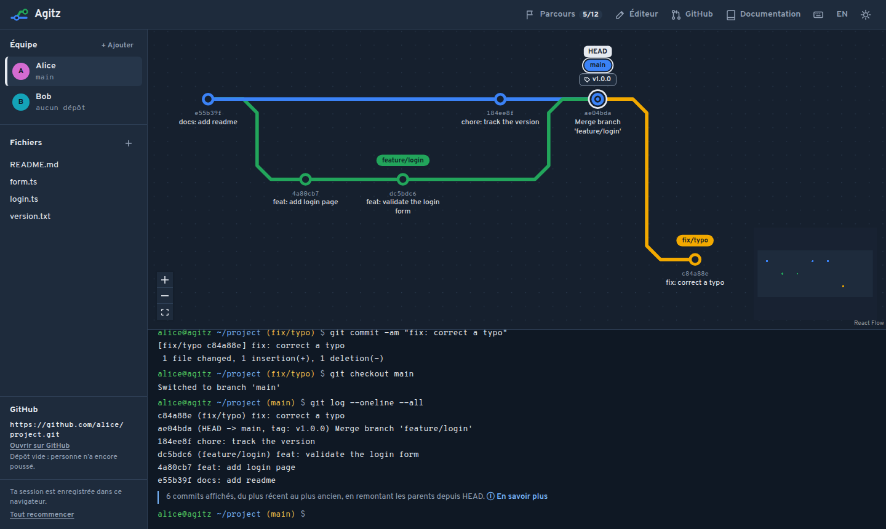

# Agitz

Learn Git and GitHub from A to Z, visually and interactively, entirely in the browser.

Agitz is an interactive Git playground for beginners and self-taught developers. Type real `git`
commands in a terminal and watch the commit graph redraw instantly, with a plain explanation of what
each command did and why. A simulated Git engine, a simulated GitHub and virtual teammates let you
practice everything from your first commit to reviewing and merging pull requests, without a GitHub
account, an internet connection or anyone to practice with.

**[Try it online](https://juka-sln.github.io/Agitz/)**



## From A to Z

Agitz starts from an empty folder and takes you all the way to team workflows on GitHub:

1. **The basics:** create a repository, stage files and record commits with clear messages.
2. **Branches:** branch out, merge, and read the history as a graph.
3. **Undoing things:** revert, reset, stash work in progress and cherry-pick a single commit.
4. **Releases:** tag versions following semantic versioning.
5. **Rewriting history:** rebase a branch and see its commits being replayed.
6. **Remotes:** clone, fetch, pull and push to a shared repository.
7. **Teamwork:** switch between teammates, run into a conflict and resolve it.
8. **GitHub:** fork, open a pull request, request a review, protect a branch and merge.

You can explore freely in a sandbox, or follow a guided course whose missions walk through these
steps in order.

## Features

- **Real commands, real output.** Type `git` commands in a terminal and get the messages Git
  itself prints, errors and hints included. Supported: `init`, `add`, `status`, `commit`, `log`,
  `branch`, `checkout`, `merge`, `rebase`, `cherry-pick`, `reset`, `revert`, `stash`, `tag`,
  `clone`, `remote`, `fetch`, `pull` and `push`, plus `echo`, `cat`, `ls`, `touch` and `rm`
  to edit the working tree.
- **A live commit graph.** Every branch is a transit line and every commit a station; the graph
  redraws after each command, and rebased or cherry-picked commits visibly travel to their new place.
- **A team on one screen.** Switch between Alice, Bob and any teammate you add. Each one has their
  own workstation; they share repositories hosted on a simulated GitHub.
- **A simulated GitHub.** Create and fork repositories, open pull requests, ask a simulated teammate
  for a review, merge with a merge commit, a squash or a rebase, protect branches, track issues and
  watch a CI run on every push.
- **Conflict resolution.** Play a scripted conflict between two teammates, then resolve it in an
  editor that shows both sides and the next command to type.
- **Built-in documentation.** A page per command (options, examples, what happens under the hood,
  pitfalls) and guides on commit messages, branching strategies, merge vs rebase, `.gitignore`,
  semantic versioning, code review and pull requests. Each command explains its result in plain words.
- **A guided course.** Twelve missions, from the first commit to a merged pull request, award badges
  as you go.
- **Made to stay in.** French and English, light and dark themes, keyboard shortcuts (press `?`),
  usable on a phone, accessible to screen readers, and the session is saved in the browser.

## Getting started

Agitz needs Node.js 22 or later.

```bash
git clone https://github.com/juka-sln/Agitz.git
cd Agitz
npm install
npm run dev
```

| Script                  | Purpose                                        |
| ----------------------- | ---------------------------------------------- |
| `npm run dev`           | Start the development server                   |
| `npm run build`         | Type-check and build the static site in `dist` |
| `npm run preview`       | Serve the production build locally             |
| `npm test`              | Run the test suite once                        |
| `npm run test:coverage` | Run the tests and report coverage              |
| `npm run lint`          | Lint the code                                  |
| `npm run typecheck`     | Type-check without building                    |
| `npm run format`        | Format every file with Prettier                |

## Architecture

Agitz is a static single-page application: everything, Git engine included, runs in the browser.
The code follows Clean Architecture, and an ESLint rule rejects any import that points the wrong way.

```
src/
├── domain/          Entities, value objects, errors and pure services (history, diffs, merges)
├── application/     One use case per Git command and per GitHub action, plus read-only queries
├── infrastructure/  SHA-1 hashing, command line parsing, the shell and browser storage
├── presentation/    React components, Zustand stores and hooks
├── content/         Documentation pages, guides and missions in French and English
└── shared/          Language and text helpers used by several layers
```

A command flows from the terminal to the shell, which hands `git` commands to the engine. The engine
parses the arguments into a typed input for a use case, which returns a new immutable workspace,
the output to print and an explanation key. The graph, the file explorer and the prompt are all
derived from that state.

Blob hashes match the ones real Git computes; tree and commit hashes are simplified.

### Stack

React 18, TypeScript (strict), Vite, Tailwind CSS, Zustand, React Flow, Vitest and Testing Library,
ESLint, Prettier, Husky and lint-staged.

## Contributing

- Branch off `develop` with `feature/<name>` or `fix/<name>`, and merge back into `develop`.
- `main` only receives `release/x.y.z` branches; each release is tagged.
- Write commit messages in English following [Conventional Commits](https://www.conventionalcommits.org/).
- The pre-commit hook lints and formats the staged files, then runs the whole test suite.
- Every Git command has unit tests for its use case; the documentation tests fail if a command the
  engine runs has no page, or if the French and English texts drift apart.

## Deployment

Pushing to `main` builds the site and publishes it to GitHub Pages through
[`.github/workflows/deploy.yml`](.github/workflows/deploy.yml). The build reads `BASE_PATH` to serve
the app from `/<repository>/`; it defaults to `/`, so `dist` also works on any static host at the
root of a domain.
